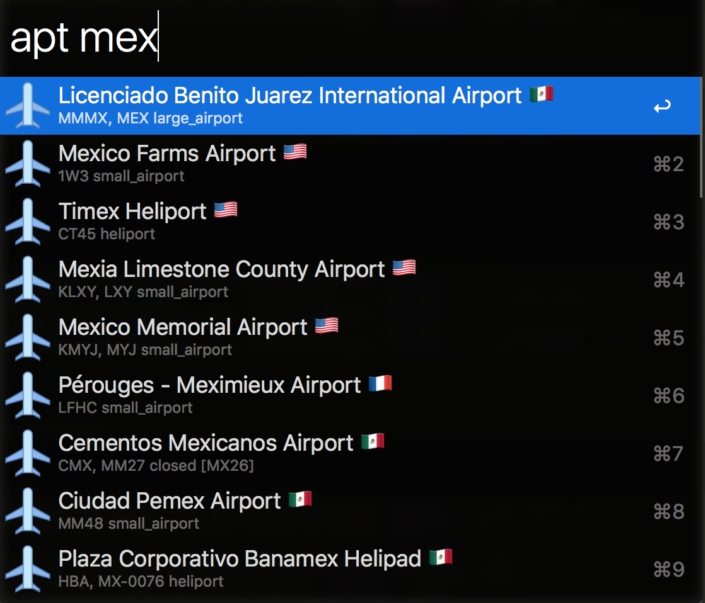
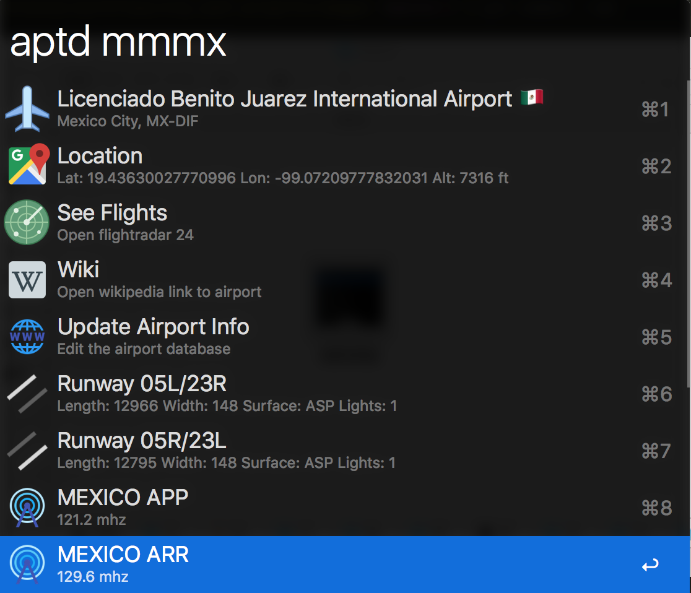

# Airport Searching Workflow

This workflow will search for Airports from the [Our Airports](http://ourairports.com/data/) data set.  

## Supported commands

* aptinit : Initialize the Dataset

* apt : Search the database

* aptd : Load details for a specific ICAO airport

### Notes:

* Data set from: Ourairports.com
* Icons from: Icons8_